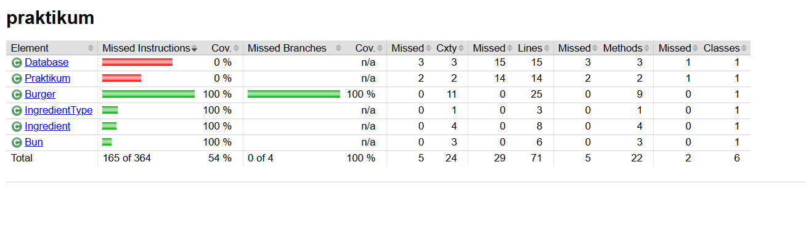

# Diplom_1 — Юнит-тесты для Stellar Burgers

Дипломный проект по автоматизации тестирования. Полное покрытие юнит-тестами (100%) для программы заказа бургеров Stellar Burgers.

## 📋 Описание проекта

Программа помогает заказать бургер в Stellar Burgers. Состоит из следующих классов:

- **`Burger`** — модель бургера с булочкой и ингредиентами
- **`Bun`** — модель булочки (название + цена)
- **`Ingredient`** — модель ингредиента (тип + название + цена)
- **`IngredientType`** — enum типов ингредиентов (SAUCE, FILLING)
- **`Database`** — база данных доступных булочек и ингредиентов
- **`Praktikum`** — точка входа в приложение

## 🧪 Что тестируется

### Burger

- ✅ `setBuns()` — установка булочки
- ✅ `addIngredient()` — добавление ингредиента
- ✅ `removeIngredient()` — удаление ингредиента (позитивные и негативные тесты)
- ✅ `moveIngredient()` — перемещение ингредиента (позитивные и негативные тесты)
- ✅ `getPrice()` — расчёт цены бургера (параметризация)
- ✅ `getReceipt()` — формирование рецепта

### Bun & Ingredient

- ✅ Геттеры `getName()`, `getPrice()`, `getType()`
- ✅ Параметризация с разными типами ингредиентов
- ✅ Граничные случаи (пустые значения, нулевые цены)

## 📦 Стек технологий

- **Java** — 11
- **Maven** — сборка и управление зависимостями
- **JUnit 4.13.2** — фреймворк для тестирования
- **Mockito 4.11.0** — мокирование объектов
- **JaCoCo 0.8.15** — анализ покрытия кода

## 📁 Структура проекта
src/
├── main/java/praktikum/
│ ├── Burger.java
│ ├── Bun.java
│ ├── Ingredient.java
│ ├── IngredientType.java
│ ├── Database.java
│ └── Praktikum.java
└── test/java/praktikum/
├── BurgerTest.java
├── BurgerPriceParameterizedTest.java
├── BurgerRemovePositiveTest.java
├── BurgerRemoveNegativeTest.java
├── BurgerMovePositiveTest.java
├── BurgerMoveNegativeTest.java
├── BunTest.java
└── IngredientTest.java

## 🧪 Тестовые классы

| Класс | Количество тестов | Описание |
|-------|-------------------|----------|
| `BurgerTest` | 13 | Основные методы `Burger` (булочка, добавление ингредиентов, цена, рецепт) |
| `BurgerPriceParameterizedTest` | 6 | Параметризованные тесты расчёта цены с разными комбинациями |
| `BurgerRemovePositiveTest` | 6 | Удаление ингредиентов (позитивные сценарии) |
| `BurgerRemoveNegativeTest` | 8 | Удаление с невалидными индексами (ожидание исключений) |
| `BurgerMovePositiveTest` | 21 | Перемещение ингредиентов (позитивные сценарии) |
| `BurgerMoveNegativeTest` | 5 | Перемещение с невалидными индексами (ожидание исключений) |
| `BunTest` | 8 | Параметризованные тесты для булочек |
| `IngredientTest` | 14 | Параметризованные тесты для ингредиентов |

**Итого: 81 тест**

## 📊 Покрытие кода

✅ **100% покрытие** для всех основных классов:

- `Burger` — все публичные методы
- `Bun` — все геттеры
- `Ingredient` — все геттеры
- `IngredientType` — все значения enum

Отчёт сгенерирован с помощью **JaCoCo**.



## 🚀 Запуск

### Требования

- Java 11+
- Maven 3.6+

### Запустить все тесты

```bash
mvn clean test

Запустить конкретный тест
mvn test -Dtest=BurgerTest
mvn test -Dtest=BurgerTest#setBunsShouldSetBun
mvn test -Dtest=BurgerPriceParameterizedTest
Сгенерировать отчёт покрытия JaCoCo
bash
mvn clean verify
Отчёт будет доступен в: target/site/jacoco/index.html

💡 Особенности реализации
Параметризованные тесты
Использование @RunWith(Parameterized.class) для тестирования разных сценариев:

Разные типы ингредиентов (SAUCE, FILLING)

Разные цены булочек и ингредиентов

Граничные случаи (пустые значения, нулевые цены)

Мокирование с Mockito
Использование @Mock и MockitoAnnotations.openMocks() для:

Изоляции тестов от внешних зависимостей

Проверки взаимодействия между объектами

Контроля поведения зависимостей

Негативные тесты
Явная проверка исключений (@Test(expected = ...)) для:

Невалидных индексов при удалении ингредиентов

Невалидных индексов при перемещении ингредиентов

Проверки что список не меняется при ошибке

📈 Результаты
✅ Все 81 тест проходят успешно

✅ 100% покрытие кода

✅ Нет дублирования кода в тестах

✅ Используются best practices JUnit и Mockito

👤 Автор
Valery Belyayeva
